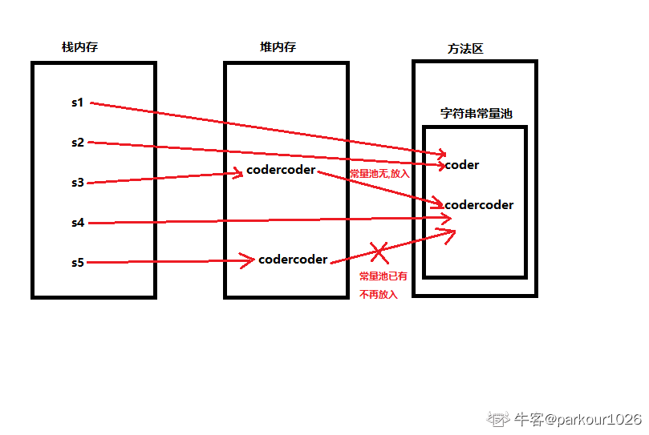

# Java 刷题总结 - 2026-07-22 day4

来源：[练习day4.md](D:/Documents/Documents%20Of%20Java/刷题/练习day4.md)

原始材料归档：[练习day4.md](D:/Workspace/刷题/原始材料/练习day4.md)

## 今日概览

- Java 题：9 道
- 已知错题：8 道
- 高频考点：多重 `catch`、`StringBuffer`/`StringBuilder`、线程启动、`static` 方法、`Object` 方法、字符串拼接、数组复制、集合工具类、`volatile`

## Java-001 多重 `catch` 顺序

**题目：**

下列类在多重 `catch` 中同时出现时，哪一个异常类应放最后一个列出？

**选项：**

- A. `ArithmeticException`
- B. `NumberFormatException`
- C. `Exception`
- D. `ArrayIndexOutOfBoundException`

**正确答案：** C

**你的答案：** B

**解析：**

多重 `catch` 的顺序应该从具体异常到一般异常，也就是先子类后父类。

`Exception` 是很多异常类的父类，如果放在前面，会先捕获子类异常，后面的具体异常分支就不可达，导致编译错误。因此 `Exception` 应该放在最后。

**考点：**

- 多重 `catch`
- 异常继承
- 子类异常先捕获

**易错点：**

- 父类异常不能放在子类异常前面

## Java-002 `String`、`StringBuffer`、`StringBuilder`

**题目：**

下面关于 Java 中 `String`、`StringBuffer`、`StringBuilder` 相关的说法错误的是？

**选项：**

- A. `String` 是字符串类，`String` 对象一旦被创建，它的值就不能被修改
- B. 当对 `StringBuffer` 对象进行修改时，不会创建新的对象，而是在原始对象上进行操作
- C. `StringBuffer` 不是线程安全的，`StringBuilder` 是线程安全的
- D. `String` 对象的不可变性使得它在多线程环境下是线程安全的

**正确答案：** C

**你的答案：** 未记录

**解析：**

C 错误。`StringBuffer` 的很多方法带有同步控制，通常认为是线程安全的；`StringBuilder` 不做同步控制，通常认为是非线程安全的。

A 正确。`String` 不可变。

B 正确。`StringBuffer` 是可变字符序列，修改时通常在原对象内部缓冲区上操作。

D 正确。`String` 不可变，因此共享字符串对象不会因内容修改产生线程安全问题。

**考点：**

- `String` 不可变
- `StringBuffer` 线程安全
- `StringBuilder` 非线程安全

**易错点：**

- `StringBuffer` 和 `StringBuilder` 的线程安全性容易记反

## Java-003 线程执行入口

**题目：**

Which method you define as the starting point of new thread in a class from which new thread can be execution?

下列哪一个方法你认为是新线程开始执行的点，也就是从该点开始线程被执行？

**选项：**

- A. `public void start()`
- B. `public void run()`
- C. `public void int()`
- D. `public static void main(String args[])`
- E. `public void runnable()`

**正确答案：** B

**你的答案：** A

**解析：**

`start()` 用来启动线程，使线程进入就绪状态，等待 CPU 调度。

新线程真正执行的入口是 `run()`。当线程获得 CPU 时间片后，会执行 `run()` 方法中的代码。

**一句话记忆：**

- `start()`：启动线程
- `run()`：线程执行入口

**考点：**

- `Thread.start()`
- `Thread.run()`
- 线程就绪与运行

**易错点：**

- 直接调用 `run()` 不会开启新线程，只是普通方法调用
- 调用 `start()` 后不一定马上执行

## Java-004 类方法 `static`

**题目：**

下列说法错误的有？

**选项：**

- A. 在类方法中可用 `this` 来调用本类的类方法
- B. 在类方法中调用本类的类方法时可直接调用
- C. 在类方法中只能调用本类中的类方法
- D. 在类方法中绝对不能调用实例方法

**正确答案：** A、C、D

**你的答案：** B、C

**解析：**

这里的“类方法”一般指 `static` 方法。

A 错误。`this` 表示当前对象，`static` 方法属于类，不属于某个具体对象，因此静态方法中不能使用 `this`。

B 正确。同一个类中的静态方法可以直接调用另一个静态方法：

```java
static void m1() {}
static void m2() {
    m1();
}
```

C 错误。类方法也可以调用其他类的类方法，例如 `A.hello()`。

D 错误。类方法不能直接调用实例方法，但可以创建对象后通过对象调用实例方法：

```java
Test t = new Test();
t.instanceMethod();
```

**考点：**

- `static`
- `this`
- 类方法与实例方法

**易错点：**

- `static` 方法中没有当前对象，不能用 `this`
- “不能直接调用实例方法”不等于“绝对不能调用实例方法”

## Java-005 `Object` 类方法

**题目：**

下面不属于 `Object` 类中方法的是？

**选项：**

- A. `hashCode()`
- B. `finally()`
- C. `wait()`
- D. `toString()`

**正确答案：** B

**你的答案：** 未记录

**解析：**

`Object` 类中的常见方法有：

```java
hashCode()
equals()
toString()
getClass()
clone()
finalize()
wait()
notify()
notifyAll()
```

`finally` 是异常处理语法中的关键字，不是 `Object` 类方法，也不是 `finally()` 方法。

**考点：**

- `Object`
- `finally`
- `finalize()`

**易错点：**

- `finally` 和 `finalize()` 不是一回事

## Java-006 字符串拼接与常量池

**题目：**

观察下列代码，分析结果：

```java
String s1 = "coder";
String s2 = "coder";
String s3 = "coder" + s2;
String s4 = "coder" + "coder";
String s5 = s1 + s2;
System.out.println(s3 == s4);
System.out.println(s3 == s5);
System.out.println(s4 == "codercoder");
```

**选项：**

- A. `false; false; true;`
- B. `false; true; true;`
- C. `false; false; false;`
- D. `true; false; true;`

**正确答案：** A

**你的答案：** C

**解析：**

`s4 = "coder" + "coder"` 是纯字符串字面量拼接，编译期会优化为 `"codercoder"`，因此：

**原文件解析图片：**



```java
s4 == "codercoder" // true
```

`s3 = "coder" + s2` 和 `s5 = s1 + s2` 都包含变量参与拼接，通常在运行期创建新的字符串对象，因此 `s3` 和 `s4` 不是同一个对象，`s3` 和 `s5` 也不是同一个对象。

所以输出：

```text
false
false
true
```

**考点：**

- 字符串常量池
- 编译期常量拼接
- 变量参与拼接
- `==`

**易错点：**

- 字符串字面量拼接和变量拼接不一样
- `==` 比较引用，不比较内容

## Java-007 数组复制效率

**题目：**

Java 语言的下面几种数组复制方法中，哪个效率最高？

**选项：**

- A. `for` 循环逐一复制
- B. `System.arraycopy`
- C. `Array.copyOf`
- D. 使用 `clone` 方法

**正确答案：** B

**你的答案：** C

**解析：**

`System.arraycopy` 是 `native` 方法，底层由本地代码实现，通常效率最高。

`Arrays.copyOf` 内部也会调用 `System.arraycopy`，但多了一层封装和新数组创建逻辑。

`clone` 通常也比较快，但不如直接调用 `System.arraycopy` 灵活。

`for` 循环逐个复制通常效率最低。

**注意：**

选项 C 图中写作 `Array.copyOf`，实际 Java 工具类应为 `Arrays.copyOf`。

**考点：**

- `System.arraycopy`
- `Arrays.copyOf`
- `clone`
- 数组复制

**易错点：**

- `System` 类没有 `copyOf`
- `Arrays.copyOf` 底层仍依赖 `System.arraycopy`

## Java-008 `Collection` 与 `Collections`

**题目：**

对 `Collection` 和 `Collections` 描述正确的是？

**选项：**

- A. `Collection` 是 `java.util` 下的类，它包含有各种有关集合操作的静态方法
- B. `Collection` 是 `java.util` 下的接口，它是各种集合结构的父接口
- C. `Collections` 是 `java.util` 下的接口，它是各种集合结构的父接口
- D. `Collections` 是 `java.util` 下的类，它包含有各种有关集合操作的静态方法

**正确答案：** B、D

**你的答案：** D

**解析：**

`Collection` 是 `java.util` 包下的顶层接口，是 `List`、`Set` 等集合接口的父接口之一，定义了集合的通用操作，例如 `add()`、`remove()`、`contains()`。

`Collections` 是 `java.util` 包下的工具类，提供大量操作集合的静态方法，例如 `sort()`、`binarySearch()`、`reverse()`。

**考点：**

- `Collection`
- `Collections`
- 接口与工具类

**易错点：**

- 带 `s` 的 `Collections` 是工具类
- 不带 `s` 的 `Collection` 是接口

## Java-009 `volatile`

**题目：**

下列关于 Java 中 `volatile` 关键字的说法正确的是？

**选项：**

- A. `volatile` 关键字修饰的变量被修改之前会从主存中读取最新的值覆盖掉 CPU 缓存
- B. `volatile` 底层实现遵循 `happens-before` 原则
- C. `volatile` 关键字修饰的共享变量是线程安全的
- D. `volatile` 关键字可以保证被修饰变量在运算时不会进行指令重排

**正确答案：** A、B、D

**你的答案：** A、D

**解析：**

B 正确。Java 内存模型中规定：对 `volatile` 变量的写操作，`happens-before` 后续对这个 `volatile` 变量的读操作。

D 按考试理解正确。`volatile` 会通过内存屏障禁止相关指令重排序，典型场景是双重检查锁单例中的：

```java
private static volatile Singleton instance;
```

C 错误。`volatile` 只能保证可见性和一定程度的有序性，不能保证复合操作的原子性。例如：

```java
volatile int count = 0;
count++;
```

`count++` 包含读、加、写三步，多线程下仍然可能丢失更新。

A 按题库答案算正确，但表述不够严谨。更准确的说法是：读 `volatile` 变量能读到主内存中的最新值，写 `volatile` 变量会把修改结果刷新到主内存。不要把它理解成 `count++` 这类复合操作也变成线程安全。

**考点：**

- `volatile`
- 可见性
- 有序性
- 原子性
- `happens-before`

**易错点：**

- `volatile` 不保证原子性
- `volatile` 变量不等于线程安全变量

## 今日错题回炉

| 编号 | 正确答案 | 你的答案 | 错因 | 复习动作 |
| --- | --- | --- | --- | --- |
| Java-001 | C | B | 多重 `catch` 顺序不牢 | 按“子类先，父类后”重排异常 |
| Java-003 | B | A | 混淆 `start()` 与 `run()` | 说出二者区别 |
| Java-004 | A、C、D | B、C | `static` 调用规则不清 | 写出静态方法中能/不能直接调用什么 |
| Java-006 | A | C | 字符串常量拼接规则不牢 | 区分字面量拼接和变量拼接 |
| Java-007 | B | C | 误以为 `Arrays.copyOf` 最高效 | 记住 `System.arraycopy` 是 native |
| Java-008 | B、D | D | 少选 `Collection` 接口 | 区分 `Collection` 和 `Collections` |
| Java-009 | A、B、D | A、D | 漏掉 `happens-before` | 复习 volatile 写读规则 |
