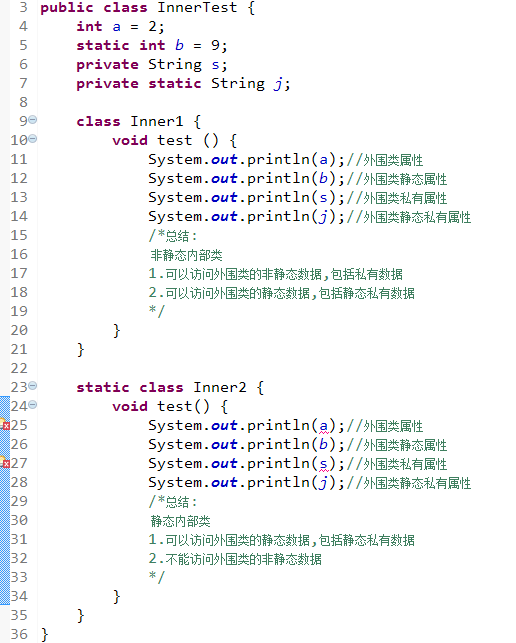

# Java 刷题总结 - 2026-07-25 day6

来源：[练习day6.md](D:/Documents/Documents%20Of%20Java/刷题/练习day6.md)

原始材料归档：[练习day6.md](D:/Workspace/刷题/原始材料/练习day6.md)

## 今日概览

- Java 题：5 道
- 已知错题：3 道
- 高频考点：对象创建内存过程、自增自减、内部类、`PreparedStatement`、Java 方法必须属于类

## Java-001 `A a = new A()` 的运行过程

**题目：**

关于语句 `A a = new A();` 的运行过程说法正确的是？

**选项：**

- A. 1. 在堆内存分配存储空间 2. 在栈内存分配变量 A 的空间 3. 在分配好的堆内存空间实例化 A 对象 4. 将 a 变量指向分配的堆内存地址
- B. 1. 在栈内存分配变量 a 的空间 2. 在堆内存分配存储空间 3. 在分配好的堆内存空间实例化 A 对象 4. 将 a 变量指向分配的堆内存地址
- C. 1. 在栈内存分配变量 a 的空间 2. 在堆内存分配存储空间 3. 将 a 变量指向分配的堆内存地址 4. 在分配好的堆内存空间实例化 A 对象
- D. 1. 在栈内存分配变量 a 的空间 2. 在堆内存分配存储空间 3. 将 a 变量指向堆内存中的实例化对象 A 4. 在分配好的堆内存空间实例化 A 对象

**正确答案：** B

**你的答案：** B

**解析：**

`A a = new A();` 可以粗略理解为：

1. 在栈中创建引用变量 `a`
2. 在堆中为 `new A()` 分配对象空间
3. 调用构造过程初始化对象
4. 将堆中对象地址赋给栈中的引用变量 `a`

**考点：**

- 栈内存保存局部变量和引用
- 堆内存保存对象实例
- 引用变量指向对象

**易错点：**

- 变量 `a` 本身在栈中，对象实例在堆中

## Java-002 自减运算与复合赋值

**题目：**

如下 Java 语句：

```java
double x = 3.0;
int y = 5;
x /= --y;
```

执行后，`x` 的值是？

**选项：**

- A. `3`
- B. `0.6`
- C. `0.4`
- D. `0.75`

**正确答案：** D

**你的答案：** 未记录

**解析：**

`--y` 是先自减再参与运算。原来 `y = 5`，执行 `--y` 后 `y = 4`。

```java
x /= --y;
```

等价于：

```java
x = x / 4;
```

所以：

```text
3.0 / 4 = 0.75
```

**考点：**

- 前置自减 `--y`
- 后置自减 `y--`
- 复合赋值

**易错点：**

- `--y` 先减再用
- `y--` 先用再减

**原文件解析：**

关键就是 `--y` 和 `y--`，前者先减再赋值，后者先赋值后减。

## Java-003 静态内部类与非静态内部类

**题目：**

静态内部类不可以直接访问外部类的非静态数据，而非静态内部类可以直接访问外部类的数据，包括私有数据。

**原文件解析图片：**



**选项：**

- A. 正确
- B. 错误

**正确答案：** A

**你的答案：** B

**解析：**

静态内部类属于外部类本身，不依赖外部类对象实例，因此可以直接访问外部类的静态成员，包括私有静态成员；但不能直接访问外部类的非静态成员。

非静态内部类依赖外部类实例，天然持有外部类对象引用，因此可以访问外部类的实例成员、静态成员和私有成员。

**考点：**

- 静态内部类
- 成员内部类
- 外部类实例引用

**易错点：**

- 静态内部类不能直接访问外部类非静态成员
- 非静态内部类可以访问外部类私有成员

**原文件解析：**

静态内部类本身可以访问外部的静态资源，包括静态私有资源；但是不能访问非静态资源，可以不依赖外部类实例而实例化。

成员内部类本身可以访问外部的所有资源，但是自身不能定义静态资源，因为其实例化本身依赖外部类。

局部内部类不能被访问修饰符修饰，也不能被 `static` 修饰。局部内部类只能访问所在代码块或者方法中被定义为 `final` 的局部变量。

匿名内部类没有类名，不能使用 `class`、`extends` 和 `implements`，没有构造方法；常用于 GUI 事件处理；不能定义静态资源；只能创建一个匿名内部类实例；匿名内部类一定是在 `new` 后面的，必须继承一个父类或者实现一个接口；匿名内部类是局部内部类的特殊形式，所以局部内部类的限制对匿名内部类也有效。

## Java-004 JDBC `Statement` 与 `PreparedStatement`

**题目：**

下面有关 JDBC statement 的说法错误的是？

**选项：**

- A. JDBC 提供了 `Statement`、`PreparedStatement` 和 `CallableStatement` 三种方式来执行查询语句，其中 `Statement` 用于普通查询，`PreparedStatement` 用于执行参数化查询，而 `CallableStatement` 则是用于存储过程
- B. 对于 `PreparedStatement` 来说，数据库可以使用已经编译以及定义好的执行计划，由于 `PreparedStatement` 对象已预编译过，所以其执行速度要快于 `Statement` 对象
- C. `PreparedStatement` 中，`?` 叫做占位符，一个占位符可以有一个或者多个值
- D. `PreparedStatement` 可以阻止常见的 SQL 注入式攻击

**正确答案：** C

**你的答案：** B

**解析：**

C 错误。`PreparedStatement` 中的 `?` 是占位符，但一个 `?` 只能绑定一个值，不能表示多个值。

B 通常认为正确。`PreparedStatement` 可以预编译 SQL 模板，重复执行时数据库有机会复用执行计划，性能和安全性通常优于直接拼接 SQL 的 `Statement`。

D 正确。参数绑定会把用户输入当作数据处理，而不是 SQL 语句片段，因此可以防止常见 SQL 注入。

**考点：**

- `Statement`
- `PreparedStatement`
- `CallableStatement`
- SQL 注入

**易错点：**

- 一个 `?` 只能对应一个参数值
- `PreparedStatement` 不是用来把多个值塞进一个占位符

**原文件解析：**

占位符 `?` 只能代表一个值。

## Java-005 Java 方法与类的关系

**题目：**

下列说法错误的有？

**选项：**

- A. Java 面向对象语言容许单独的过程与函数存在
- B. Java 面向对象语言容许单独的方法存在
- C. Java 语言中的方法属于类中的成员（member）
- D. Java 语言中的方法必定隶属于某一类（对象），调用方法与过程或函数相同

**正确答案：** A、B、D

**你的答案：** B、C

**解析：**

A 错误。Java 中所有代码都必须定义在类中，不支持独立于类之外的过程或函数。

B 错误。Java 方法必须定义在类、接口、枚举等类型体中，不能单独存在。

C 正确。方法是类的成员，和字段、构造器等一样属于类结构的一部分。

D 错误。前半句“方法必定隶属于某一类”基本正确，但“调用方法与过程或函数相同”不准确。Java 实例方法通常通过对象调用，静态方法通过类名调用，本质上仍有类或对象作为上下文。

**考点：**

- Java 面向对象
- 方法必须属于类
- 类成员

**易错点：**

- Java 没有脱离类存在的全局函数
- 静态方法像函数，但仍属于类

**原文件解析：**

A 错误。Java 是一种面向对象语言，所有代码都必须定义在类中，不支持独立于类或对象的过程或函数，没有全局函数。任何功能都必须封装在类的方法中，例如静态方法或实例方法。

B 错误。Java 中的方法必须定义在类中，不能单独存在。方法总是类或对象的成员，脱离类定义方法会导致编译错误。

C 正确。Java 中的方法，包括实例方法和静态方法，是类的重要组成部分，与字段、构造器等一样，都属于类的成员。

D 错误。虽然“方法必定隶属于某一类或对象”基本正确，但“调用方法与过程或函数相同”不准确。Java 中方法调用通常必须通过对象或类，例如 `object.method()` 或 `ClassName.method()`，需要指定接收者；过程式语言中的函数通常可以直接调用。

## 今日错题回炉

| 编号 | 正确答案 | 你的答案 | 错因 | 复习动作 |
| --- | --- | --- | --- | --- |
| Java-003 | A | B | 静态内部类访问规则不牢 | 对比静态内部类和成员内部类 |
| Java-004 | C | B | 误判 `PreparedStatement` 预编译说法 | 记住一个 `?` 只能绑定一个值 |
| Java-005 | A、B、D | B、C | Java 方法必须属于类这一点混乱 | 默写 A/B/C/D 判断理由 |
