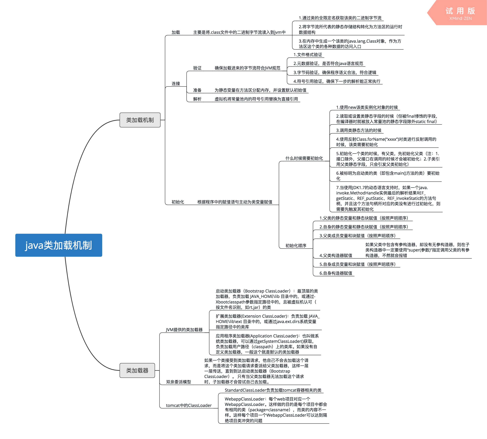

# Java 刷题总结 - 2026-07-28 day8

来源：[练习day8.md](D:/Documents/Documents%20Of%20Java/刷题/练习day8.md)

原始材料归档：[练习day8.md](D:/Workspace/刷题/原始材料/练习day8.md)

## 今日概览

- Java 题：4 道
- 已知错题：3 道
- 高频考点：抽象方法、非静态内部类创建、类加载器、`finally` 返回值

## Java-001 抽象类中添加代码

**题目：**

选项中哪一行代码可以添加到题目中而不产生编译错误？

```java
public abstract class MyClass {
    public int constInt = 5;
    // add code here
    public void method() {
    }
}
```

**选项：**

- A. `public abstract void method(int a);`
- B. `constInt = constInt + 5;`
- C. `public int method();`
- D. `public abstract void anotherMethod() {}`

**正确答案：** A

**你的答案：** B

**原文件解析：**

1. 在抽象类中可以定义抽象方法。
2. 抽象方法的语法格式正确：使用 `abstract` 修饰符，没有方法体，以分号结束。
3. 参数列表和返回值类型的定义也符合 Java 语法规则。

B：类中定义成员和方法，不能直接进行运算，可以写在代码块 `{}` 或者静态代码块 `static {}` 中。

C：有个 `{}` 和至少一个参数就对。

D：抽象方法不能有方法体。正确写法应为：`public abstract void anotherMethod();`

**我的补充解析：**

A 正确，因为抽象类中允许定义抽象方法，且 `method(int a)` 与已有的 `method()` 参数列表不同，也不会和已有方法冲突。

B 错误，类体中不能直接写赋值运算语句，除非放入方法、构造代码块或静态代码块。

C 错误，普通方法声明如果没有 `abstract`，就必须有方法体。

D 错误，抽象方法不能写方法体。

**考点：**

- 抽象类
- 抽象方法
- 类体中允许出现的成员
- 方法重载

**易错点：**

- 抽象方法以分号结束，不能有方法体
- 类体里不能直接写普通执行语句

## Java-002 非静态内部类对象创建

**题目：**

有如下 Java 代码：

```java
class Outer {
    class Inner {
    }
}

public class Test {
    public static void main(String[] args) {
        // 创建内部类对象
    }
}
```

则 `Test` 的 `main` 方法中，下面创建内部类对象正确的语句是？

**选项：**

- A. `new Outer().new Inner();`
- B. `new Outer.Inner();`
- C. `new Inner();`
- D. `new Outer.new Inner();`

**正确答案：** A

**你的答案：** B

**解析：**

`Inner` 是非静态成员内部类，创建它必须依赖外部类对象实例。正确写法是：

```java
new Outer().new Inner();
```

如果 `Inner` 是静态内部类，才可以写成：

```java
new Outer.Inner();
```

**考点：**

- 成员内部类
- 非静态内部类实例化
- 外部类实例

**易错点：**

- 非静态内部类不能脱离外部类实例创建
- `Outer.Inner` 更像静态内部类的创建方式

## Java-003 Java 类加载器

**题目：**

下面有关 Java 类加载器，说法正确的是？

**选项：**

- A. 引导类加载器（bootstrap class loader）：它用来加载 Java 的核心库，是用原生代码来实现的
- B. 扩展类加载器（extensions class loader）：它用来加载 Java 的扩展库
- C. 系统类加载器（system class loader）：它根据 Java 应用的类路径（CLASSPATH）来加载 Java 类
- D. Tomcat 为每个 App 创建一个 Loader，里面保存着此 WebApp 的 ClassLoader。需要加载 WebApp 下的类时，就取出 ClassLoader 来使用

**正确答案：** A、B、C、D

**你的答案：** 未记录

**原文件解析图片：**



**我的补充解析：**

A、B、C 是 Java 类加载器体系的基础描述。Bootstrap 加载核心类库；Extension 加载扩展目录中的类库；System/Application ClassLoader 加载应用类路径下的类。

D 也正确。Web 容器通常会为不同 Web 应用提供独立类加载器，隔离各 WebApp 的类。

**考点：**

- Bootstrap ClassLoader
- Extension ClassLoader
- System/Application ClassLoader
- WebApp ClassLoader

**易错点：**

- Tomcat 中不同 Web 应用通常有独立类加载器

## Java-004 `finally` 中 `return`

**题目：**

执行如下代码后输出结果为？

```java
public class Test {
    public static void main(String[] args) {
        System.out.println("return value of getValue(): " + getValue());
    }

    public static int getValue() {
        int i = 1;
        try {
            i = 4;
        } finally {
            i++;
            return i;
        }
    }
}
```

**选项：**

- A. `return value of getValue(): 1`
- B. `return value of getValue(): 4`
- C. `return value of getValue(): 5`
- D. 其他几项都不对

**正确答案：** C

**你的答案：** A

**解析：**

执行流程：

1. `i` 初始为 1
2. `try` 中执行 `i = 4`
3. `finally` 必定执行，先执行 `i++`，此时 `i = 5`
4. `finally` 中 `return i`，返回 5

所以输出：

```text
return value of getValue(): 5
```

**考点：**

- `try-finally`
- `finally` 必定执行
- `finally` 中的 `return`

**易错点：**

- `finally` 中写 `return` 会覆盖前面可能的返回结果
- 实际开发中不建议在 `finally` 中写 `return`

## 今日错题回炉

| 编号 | 正确答案 | 你的答案 | 错因 | 复习动作 |
| --- | --- | --- | --- | --- |
| Java-001 | A | B | 类体中不能直接写执行语句 | 区分成员声明、方法体、代码块 |
| Java-002 | A | B | 非静态内部类创建方式不牢 | 默写 `new Outer().new Inner()` |
| Java-004 | C | A | 忽略 `finally` 中返回值覆盖 | 手推执行顺序 |

