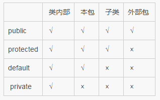

# Java 刷题总结 - 2026-07-28 day9

来源：[练习day9.md](D:/Documents/Documents%20Of%20Java/刷题/练习day9.md)

原始材料归档：[练习day9.md](D:/Workspace/刷题/原始材料/练习day9.md)

## 今日概览

- Java 题：6 道
- 已知错题：5 道
- 高频考点：局部变量默认值、访问修饰符、Servlet API、数值类型提升、Java 体系结构

## Java-001 变量分类与默认值

**题目：**

下面有关 Java 实例变量、局部变量、类变量和 `final` 变量的说法，错误的是？

**选项：**

- A. 实例变量指的是类中定义的变量，即成员变量，如果没有初始化，会有默认值
- B. 局部变量指的是在方法中定义的变量，如果没有初始化，会有默认值
- C. 类变量指的是用 `static` 修饰的属性
- D. `final` 变量指的是用 `final` 修饰的变量

**正确答案：** B

**你的答案：** A

**原文件解析：**

局部变量没有默认值，使用前必须显式初始化，否则编译报错。

**我的补充解析：**

A 正确。实例变量属于对象，未显式初始化时会有默认值。

B 错误。局部变量定义在方法、代码块或构造器内部，必须先赋值再使用，没有默认值。

C 正确。类变量通常指 `static` 修饰的成员变量。

D 正确。`final` 变量是被 `final` 修饰的变量，赋值后不能再次修改。

**考点：**

- 实例变量
- 局部变量
- 类变量
- `final`
- 默认值

**易错点：**

- 成员变量有默认值，局部变量没有默认值

## Java-002 包访问权限

**题目：**

要使某个类能被同一个包中的其他类访问，但不能被这个包以外的类访问，可以？

**选项：**

- A. 让该类不使用任何关键字
- B. 使用 `private` 关键字
- C. 使用 `protected` 关键字
- D. 使用 `void` 关键字

**正确答案：** A

**你的答案：** C

**原文件解析图片：**



**原文件解析：**

`protected` 外部包不能访问，但是子类在外部包的话，外部包的子类可以访问。

`default` 外部包、子类不能访问，意思就是外部包不可以访问，就算是子类在外部包中。但是，如果子类在内部包中，就可以访问。

**我的补充解析：**

类不写访问修饰符时是默认访问权限，也叫包访问权限，只能被同一个包中的类访问。

顶层类不能使用 `private` 或 `protected` 修饰。`protected` 主要用于成员，表示同包可访问，包外子类也可访问。

**考点：**

- 默认访问权限
- `protected`
- 包访问
- 顶层类修饰符

**易错点：**

- 同包可访问、包外不可访问，用默认访问权限
- 不写关键字不是“public”，而是 default/package-private

## Java-003 变量分类题重复出现

**题目：**

原文件中该题与 Java-001 内容重复出现：下面有关 Java 实例变量、局部变量、类变量和 `final` 变量的说法，错误的是？

**选项：**

- A. 实例变量指的是类中定义的变量，即成员变量，如果没有初始化，会有默认值
- B. 局部变量指的是在方法中定义的变量，如果没有初始化，会有默认值
- C. 类变量指的是用 `static` 修饰的属性
- D. `final` 变量指的是用 `final` 修饰的变量

**正确答案：** B

**你的答案：** A

**原文件解析：**

局部变量没有默认值，使用前必须显式初始化，否则编译报错。

**我的补充解析：**

这题和 Java-001 是同一考点，重复出现说明这个点很容易被题库反复考：局部变量没有默认值。

**考点：**

- 局部变量
- 默认值

**易错点：**

- 只要是局部变量，使用前必须显式初始化

## Java-004 `HttpServletRequest` 功能

**题目：**

下面不属于 `HttpServletRequest` 接口完成功能的是？

**选项：**

- A. 读取 cookie
- B. 读取 HTTP 头
- C. 设定响应的 content 类型
- D. 读取路径信息

**正确答案：** C

**你的答案：** D

**原文件解析：**

A 读取 Cookie：`request.getCookies()`

B 读取 HTTP 请求头：`request.getHeader("名称")`

D 读取路径信息：`request.getPathInfo()`、`request.getRequestURI()`

C 设置响应的 `Content-Type`：属于 `HttpServletResponse`

**我的补充解析：**

`HttpServletRequest` 代表请求对象，用于读取客户端发来的信息；`HttpServletResponse` 代表响应对象，用于设置响应内容、状态码、响应头等。

设置响应类型应使用：

```java
response.setContentType("text/html;charset=UTF-8");
```

**考点：**

- `HttpServletRequest`
- `HttpServletResponse`
- Cookie
- 请求头
- 响应 Content-Type

**易错点：**

- request 负责读请求，response 负责写响应

## Java-005 数值表达式结果类型

**题目：**

表达式 `(short)10 / 10.2 * 2` 运算后结果类型是？

**选项：**

- A. `short`
- B. `int`
- C. `double`
- D. `float`

**正确答案：** C

**你的答案：** A

**原文件解析：**

Java 默认浮点类型为 `double`。

`float` 数据类型有一个后缀为 `f` 或 `F`。

`long` 类型有一个后缀，为 `l` 或者 `L`。

强制类型转换的优先级高于 `+ - * /`。

**我的补充解析：**

`(short)10` 的结果是 `short`，但表达式中出现了 `10.2`，而 Java 中小数字面量默认是 `double`。因此整个 `/` 和 `*` 运算都会向 `double` 提升，最终结果类型是 `double`。

**考点：**

- 浮点字面量默认类型
- 数值类型提升
- 强制类型转换优先级

**易错点：**

- `(short)10` 只影响数字 10，不会让整个表达式保持 `short`
- 小数字面量默认是 `double`

## Java-006 Java 体系结构

**题目：**

Java 的体系结构包含？

**选项：**

- A. Java 编程语言
- B. Java 类文件格式
- C. Java API
- D. JVM

**正确答案：** A、B、C、D

**你的答案：** 未记录

**原文件解析：**

Java 体系结构包括四个独立但相关的技术：

- Java 程序设计语言
- Java `.class` 文件格式
- Java 应用编程接口（API）
- Java 虚拟机

四者的关系：

当我们编写并运行一个 Java 程序时，就同时运用了这四种技术。用 Java 程序设计语言编写源代码，把它编译成 Java `.class` 文件格式，然后再在 Java 虚拟机中运行 class 文件。当程序运行的时候，它通过调用 class 文件实现了 Java API 的方法来满足程序的 Java API 调用。

**我的补充解析：**

Java 不只是语法语言，还包括编译产物格式、运行时虚拟机和标准 API。正是这些共同构成了跨平台运行的基础。

**考点：**

- Java 语言
- `.class` 文件
- Java API
- JVM

**易错点：**

- Java 体系结构不是只包含 JVM 或语言本身

## 今日错题回炉

| 编号 | 正确答案 | 你的答案 | 错因 | 复习动作 |
| --- | --- | --- | --- | --- |
| Java-001 | B | A | 误以为实例变量没有默认值 | 区分成员变量和局部变量 |
| Java-002 | A | C | 混淆 default 和 protected | 画出访问权限表 |
| Java-003 | B | A | 重复错在局部变量默认值 | 写一段未初始化局部变量编译错误示例 |
| Java-004 | C | D | 混淆 request/response 职责 | 列出 request 读、response 写 |
| Java-005 | C | A | 忽略 `10.2` 默认 double | 手推表达式类型提升 |

