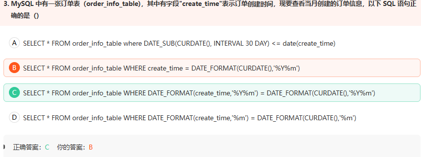
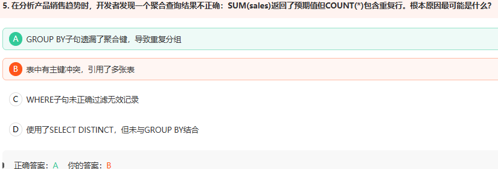
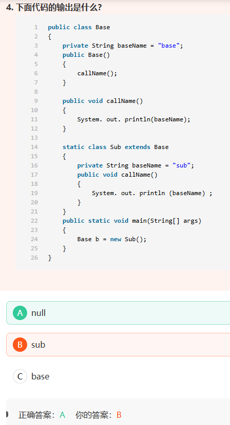
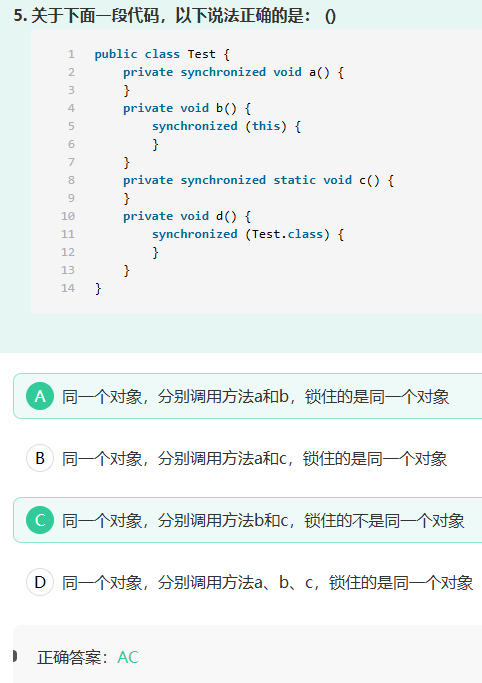
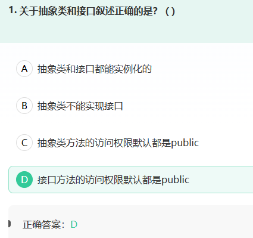
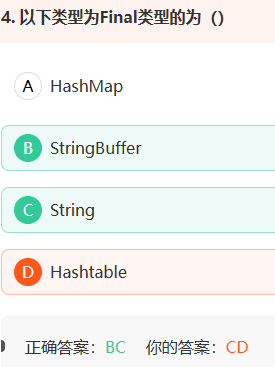
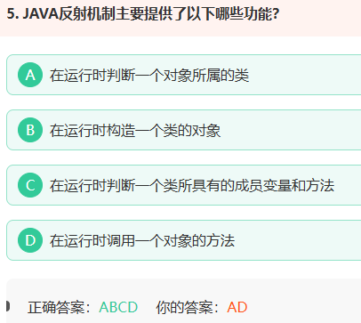

1.



B语法错误

2.




3.



解析：1.首先，需要明白**类的加载顺序**。 

  (1) 父类静态代码块(包括静态初始化块，静态属性，但不包括静态方法) 

  (2) 子类静态代码块(包括静态初始化块，静态属性，但不包括静态方法  )

   (3) 父类非静态代码块(  包括非静态初始化块，非静态属性  )

   (4) 父类构造函数

   (5) 子类非静态代码块  (  包括非静态初始化块，非静态属性  )

   (6) 子类构造函数

   其中：类中静态块按照声明顺序执行，并且(1)和(2)不需要调用new类实例的时候就执行了(意思就是在类加载到方法区的时候执行的)

  2.其次，需要理解子类覆盖父类方法的问题，也就是方法重写实现多态问题。

   Base b = new Sub();它为多态的一种表现形式，声明是Base,实现是Sub类，

 理解为b编译时表现为Base类特性，运行时表现为Sub类特性。 

   当子类覆盖了父类的方法后，意思是父类的方法已经被重写，题中父类初始化调用的方法为子类实现的方法，子类实现的方法中调用的baseName为子类中的私有属性。

   由1.可知，此时只执行到步骤4.,子类非静态代码块和初始化步骤还没有到，子类中的baseName还没有被初始化。所以此时  baseName为空。  所以为null。


执行Base b = new Sub();时由于多态 b编译时表现为Base类特性，运行时表现为Sub类特性，  Base b = new Sub()；

不管是哪种状态都会调用Base构造器执行callName()方法；

而此时子类尚未初始化（执行完父类构造器后才会开始执行子类），如果有就执行，没有再去父类寻找；如果把父类callName()改为callName2()，则会输出base

流程：

分配对象内存并赋默认值
→ 进入 Sub 构造流程
→ 调用 super()
→ 初始化 Base 实例字段
→ 执行 Base 构造方法
→ 动态调用 Sub.callName()
→ Sub.baseName 仍是 null
→ 输出 null
→ 初始化 Sub 实例字段为 "sub"
→ 执行 Sub 构造方法体

4.



修饰非静态方法 锁的是this 对象

举例

```
Test t1 = new Test();
Test t2 = new Test();
```

如果线程1执行：

```
t1.b();
```

它锁住的是：

```
t1对象
```

此时线程2也执行：

```
t1.b();
```

线程2必须等待，因为它也想获得 `t1` 的锁。

但是线程2执行：

```
t2.b();
```

通常不需要等待，因为 `t1` 和 `t2` 是两个不同对象，拥有不同的锁。

```
t1的锁 ≠ t2的锁
```

修饰静态方法 锁的是class对象

举例

```
Test t1 = new Test();
Test t2 = new Test();
```

线程1通过 `t1` 执行锁 `Test.class` 的代码：

```
t1.d();
```

线程2通过 `t2` 执行：

```
t2.d();
```

即使是两个不同对象，线程2也要等待，因为它们锁的都是：

```
Test.class
```

也就是说：

```
t1 对应的类锁 = t2 对应的类锁
```

5.



### 抽象类 

  特点: 
 1.抽象类中可以构造方法 
 2.抽象类中可以存在普通属性，方法，静态属性和方法。 
  3.抽象类中可以存在抽象方法。 
 4.**如果一个类中有一个抽象方法，那么当前类一定是抽象类；抽象类中不一定有抽象方法。**
 5.抽象类中的抽象方法，需要有子类实现，**如果子类不实现，则子类也需要定义为抽象的。**
 6,**抽象类不能被实例化，抽象类和抽象方法必须被abstract修饰**

7.抽象类中的方法访问修饰符默认是default

8.抽象类可以实现接口，而且不需要实现接口中的所有方法；

  关键字使用注意： 
  抽象类中的抽象方法（其前有abstract修饰）不能用private、static、synchronized、native访问修饰符修饰。 

###   接口 

  1.在接口中只有方法的声明，没有方法体。 
   2.**在接口中只有常量，因为定义的变量，在编译的时候都会默认加上public static final**
 3.**在接口中的方法，永远都被public来修饰**。 
  4.**接口中没有构造方法，也不能实例化接口的对象**。（所以接口不能继承类） 
 5.接口可以实现多继承
 6.**接口中定义的方法都需要有实现类来实现，如果实现类不能实现接口中的所有方法则实现类定义为抽象类。**
 7，接口可以继承接口，用extends

8.接口中方法访问修饰符默认是public abstract的，但是JDK1.8之后接口中可以有static方法或者default方法，但是这两种方法必须有方法体 


6.




通过阅读源码可以知道，string与stringbuffer都是通过字符数组实现的。 

  其中string的字符数组是final修饰的，所以字符数组不可以修改。 

  stringbuffer的字符数组没有final修饰，所以字符数组可以修改。 

  string与stringbuffer都是final修饰，只是限制他们所存储的引用地址不可修改。 

  至于地址所指内容能不能修改，则需要看字符数组可不可以修改。 


7.



  普通的java对象是通过new关键字把对应类的字节码文件加载到内存，然后创建该对象的。

  反射是通过一个名为Class的特殊类，用Class.forName("className");得到类的字节码对象，然后用newInstance()方法在虚拟机内部构造这个对象（针对无参构造函数）。

  也就是说反射机制让我们可以先拿到java类对应的字节码对象，然后动态的进行任何可能的操作  选项都是反射的功能 

