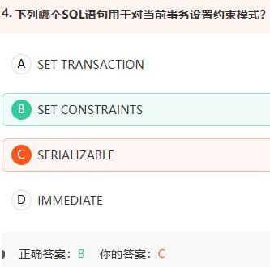
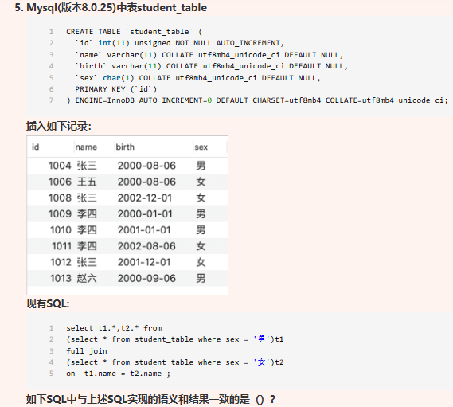
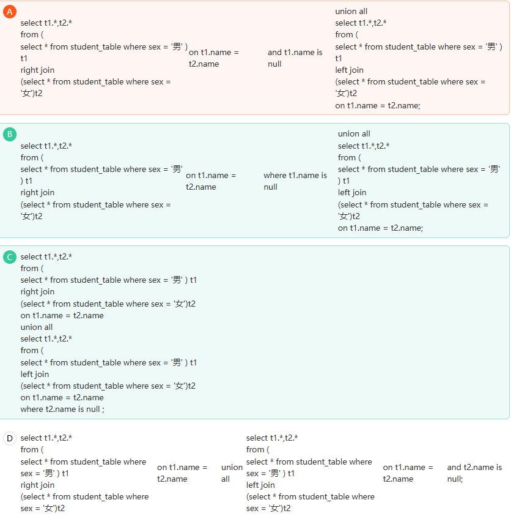
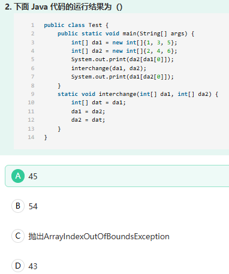
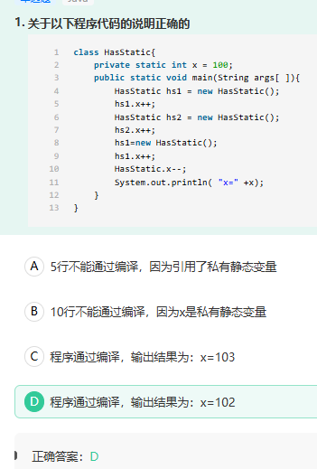
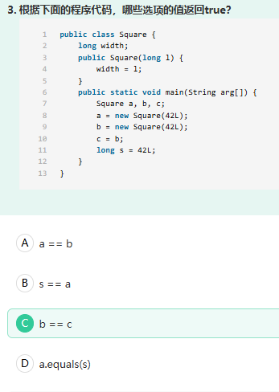
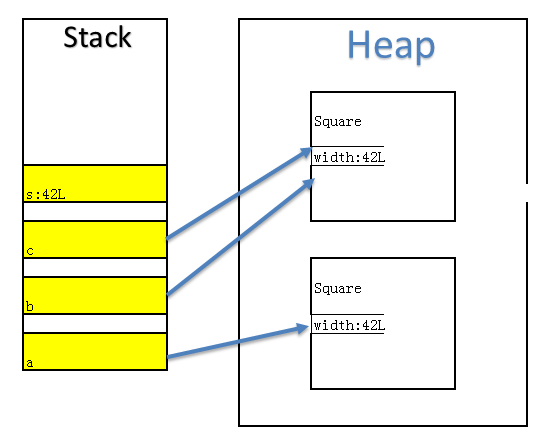
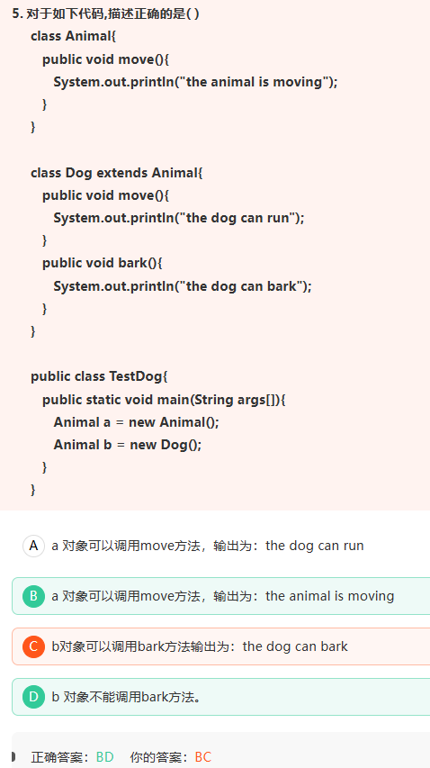
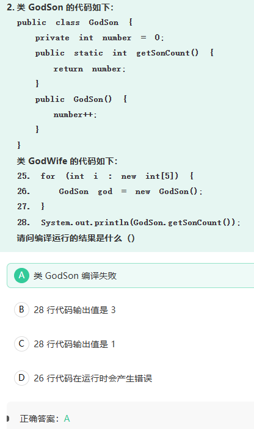

1.

哪些字段适合建立索引?

A在select子句中的字段

B外键字段

C主键字段

D在where子句中的字段

答案BCD

解析：B 外键字段适合经常用于关联查询，建立索引可提高 `JOIN` 效率C 主键字段适合主键会自动创建主键索引D `WHERE` 子句中的字段适合经常作为查询条件，可以加快数据筛选


2.



在某些情况下，并不希望每个SQL语句执行后立即进行完整性约束检查，而会延迟到事务提交时进行完整性约束检查，因此可以对当前事务设置约束模式，通常可以使用SET CONSTRAINTS对当前事务设置约束模式，并且主要是INITIALLY IMMEDIATE或者INITIALLY DEFERRED模式，故B项正确；而A项的SET TRANSACTION则是设置事务的操作，故A项排除；C项的SERIALIZABLE则是数据库隔离级别的一个选项，设置为此选项可以避免幻读，故C项排除；D项则是约束模式的一种类型，故D项排除，因此正确选项为B。


3.





答案是：**B、C**。下面把原始目标和每个选项实际产生的结果都拆开看。

为方便阅读，只展示：

```
男生ID、男生姓名 ｜ 女生ID、女生姓名
```

实际查询还会输出 `birth`、`sex`。

------

一、先确定目标 `FULL JOIN` 应该得到什么

男生数据：

| ID   | 姓名 |
| ---- | ---- |
| 1004 | 张三 |
| 1009 | 李四 |
| 1010 | 李四 |
| 1013 | 赵六 |

女生数据：

| ID   | 姓名 |
| ---- | ---- |
| 1006 | 王五 |
| 1008 | 张三 |
| 1011 | 李四 |
| 1012 | 张三 |

连接条件：

```
ON t1.name = t2.name
```

匹配结果

张三

男生有1个张三，女生有2个张三：

```
1 × 2 = 2条
```

| 男生ID | 男生姓名 | 女生ID | 女生姓名 |
| ------ | -------- | ------ | -------- |
| 1004   | 张三     | 1008   | 张三     |
| 1004   | 张三     | 1012   | 张三     |

李四

男生有2个李四，女生有1个李四：

```
2 × 1 = 2条
```

| 男生ID | 男生姓名 | 女生ID | 女生姓名 |
| ------ | -------- | ------ | -------- |
| 1009   | 李四     | 1011   | 李四     |
| 1010   | 李四     | 1011   | 李四     |

没有匹配的人

- 男生赵六没有对应女生；
- 女生王五没有对应男生。

所以完整的 `FULL JOIN` 应有6条：

| 男生ID | 男生姓名 | 女生ID | 女生姓名 |
| ------ | -------- | ------ | -------- |
| 1004   | 张三     | 1008   | 张三     |
| 1004   | 张三     | 1012   | 张三     |
| 1009   | 李四     | 1011   | 李四     |
| 1010   | 李四     | 1011   | 李四     |
| 1013   | 赵六     | `NULL` | `NULL`   |
| `NULL` | `NULL`   | 1006   | 王五     |

结果顺序没有 `ORDER BY`，因此不保证。

------

二、选项 A

A 可以整理成：

```
SELECT t1.*, t2.*
FROM 男生表 t1
RIGHT JOIN 女生表 t2
    ON t1.name = t2.name
   AND t1.name IS NULL

UNION ALL

SELECT t1.*, t2.*
FROM 男生表 t1
LEFT JOIN 女生表 t2
    ON t1.name = t2.name;
```

第一部分

```
ON t1.name = t2.name
AND t1.name IS NULL
```

想要匹配成功，要求同时满足：

```
男生姓名 = 女生姓名
男生姓名又必须为 NULL
```

但男生姓名都不为 `NULL`，所以**一条都匹配不上**。

由于使用的是 `RIGHT JOIN`，所有女生都会被保留：

| 男生ID | 男生姓名 | 女生ID | 女生姓名 |
| ------ | -------- | ------ | -------- |
| `NULL` | `NULL`   | 1006   | 王五     |
| `NULL` | `NULL`   | 1008   | 张三     |
| `NULL` | `NULL`   | 1011   | 李四     |
| `NULL` | `NULL`   | 1012   | 张三     |

共4条。

第二部分

普通 `LEFT JOIN`：

| 男生ID | 男生姓名 | 女生ID | 女生姓名 |
| ------ | -------- | ------ | -------- |
| 1004   | 张三     | 1008   | 张三     |
| 1004   | 张三     | 1012   | 张三     |
| 1009   | 李四     | 1011   | 李四     |
| 1010   | 李四     | 1011   | 李四     |
| 1013   | 赵六     | `NULL` | `NULL`   |

共5条。

A 最终结果

```
4 + 5 = 9条
```

其中张三、李四的女生记录既以“不匹配行”出现，又以正常匹配行出现，结果错误。

**A 错误。**

------

三、选项 B

B 整理后是：

```
SELECT t1.*, t2.*
FROM 男生表 t1
RIGHT JOIN 女生表 t2
    ON t1.name = t2.name
WHERE t1.name IS NULL

UNION ALL

SELECT t1.*, t2.*
FROM 男生表 t1
LEFT JOIN 女生表 t2
    ON t1.name = t2.name;
```

第一部分

先正常执行 `RIGHT JOIN`，再通过：

```
WHERE t1.name IS NULL
```

只保留“女生存在、男生不存在”的数据。

只有王五：

| 男生ID | 男生姓名 | 女生ID | 女生姓名 |
| ------ | -------- | ------ | -------- |
| `NULL` | `NULL`   | 1006   | 王五     |

共1条。

第二部分

普通 `LEFT JOIN` 得到：

| 男生ID | 男生姓名 | 女生ID | 女生姓名 |
| ------ | -------- | ------ | -------- |
| 1004   | 张三     | 1008   | 张三     |
| 1004   | 张三     | 1012   | 张三     |
| 1009   | 李四     | 1011   | 李四     |
| 1010   | 李四     | 1011   | 李四     |
| 1013   | 赵六     | `NULL` | `NULL`   |

共5条。

B 最终结果

```
1 + 5 = 6条
```

刚好是：

```
匹配数据
+ 男表独有的赵六
+ 女表独有的王五
```

**B 正确。**

------

四、选项 C

C 整理后是：

```
SELECT t1.*, t2.*
FROM 男生表 t1
RIGHT JOIN 女生表 t2
    ON t1.name = t2.name

UNION ALL

SELECT t1.*, t2.*
FROM 男生表 t1
LEFT JOIN 女生表 t2
    ON t1.name = t2.name
WHERE t2.name IS NULL;
```

第一部分

完整的 `RIGHT JOIN`：

| 男生ID | 男生姓名 | 女生ID | 女生姓名 |
| ------ | -------- | ------ | -------- |
| 1004   | 张三     | 1008   | 张三     |
| 1004   | 张三     | 1012   | 张三     |
| 1009   | 李四     | 1011   | 李四     |
| 1010   | 李四     | 1011   | 李四     |
| `NULL` | `NULL`   | 1006   | 王五     |

共5条。

它包含：

```
匹配的数据 + 女表独有的王五
```

第二部分

普通 `LEFT JOIN` 后，通过：

```
WHERE t2.name IS NULL
```

只保留“男生存在、女生不存在”的数据：

| 男生ID | 男生姓名 | 女生ID | 女生姓名 |
| ------ | -------- | ------ | -------- |
| 1013   | 赵六     | `NULL` | `NULL`   |

共1条。

C 最终结果

```
5 + 1 = 6条
```

也完整包含匹配数据和两边未匹配数据。

**C 正确。**

------

五、选项 D

D 整理后是：

```
SELECT t1.*, t2.*
FROM 男生表 t1
RIGHT JOIN 女生表 t2
    ON t1.name = t2.name

UNION ALL

SELECT t1.*, t2.*
FROM 男生表 t1
LEFT JOIN 女生表 t2
    ON t1.name = t2.name
   AND t2.name IS NULL;
```

第一部分

正常的 `RIGHT JOIN`，得到5条：

| 男生ID | 男生姓名 | 女生ID | 女生姓名 |
| ------ | -------- | ------ | -------- |
| 1004   | 张三     | 1008   | 张三     |
| 1004   | 张三     | 1012   | 张三     |
| 1009   | 李四     | 1011   | 李四     |
| 1010   | 李四     | 1011   | 李四     |
| `NULL` | `NULL`   | 1006   | 王五     |

第二部分

连接条件是：

```
ON t1.name = t2.name
AND t2.name IS NULL
```

要求女生姓名既等于男生姓名，又必须是 `NULL`。

题目中的女生姓名都不为 `NULL`，所以所有男生都匹配失败。

由于是 `LEFT JOIN`，全部男生仍会保留：

| 男生ID | 男生姓名 | 女生ID | 女生姓名 |
| ------ | -------- | ------ | -------- |
| 1004   | 张三     | `NULL` | `NULL`   |
| 1009   | 李四     | `NULL` | `NULL`   |
| 1010   | 李四     | `NULL` | `NULL`   |
| 1013   | 赵六     | `NULL` | `NULL`   |

共4条。

D 最终结果

```
5 + 4 = 9条
```

张三和李四既出现了正常匹配行，又被错误地当成未匹配男生。

**D 错误。**

------

最后对比

| 选项 | 第一部分               | 第二部分               | 总行数 | 判断 |
| ---- | ---------------------- | ---------------------- | ------ | ---- |
| A    | 所有女生都被当成未匹配 | 完整左连接             | 9      | 错   |
| B    | 只取右表独有的王五     | 完整左连接             | 6      | 对   |
| C    | 完整右连接             | 只取左表独有的赵六     | 6      | 对   |
| D    | 完整右连接             | 所有男生都被当成未匹配 | 9      | 错   |

最关键区别

正确写法是：

```
LEFT JOIN ...
WHERE 右表字段 IS NULL
```

而不是：

```
LEFT JOIN ...
ON 匹配条件 AND 右表字段 IS NULL
```

`WHERE ... IS NULL` 是在连接完成后筛选**真正未匹配的行**；写在 `ON` 中则会改变连接条件，导致原本能匹配的数据也无法匹配。

****

4.



Java 参数传递是值传递。这里传递的是两个数组引用的副本，所以方法结束后，`main` 中的 `da1` 和 `da2` 并没有交换。

5.



x 是 static 静态变量，属于整个 HasStatic 类，所有对象共享同一个 x 并且代码就在 `HasStatic` 类内部，可以访问x

6.





`s` 会自动装箱成 `Long` 对象

7.



由于Java有父类委托机制。父类委托机制工作过程是：如果一个类加载器收到了类加载的请求，他首先不会自己去尝试加载这个类，而是把这个请求委托给父类加载器去完成，每一个层级的类加载都是如此，因此所有的加载请求最终都应该传送到顶层的启动类加载器中，只有当父加载器反馈自己无法完成这个加载请求时，子加载器才会尝试自己去加载。 b 此时是一个Animal对象， Animal对象没有bark方法， 因此b对象不能调用bark方法


8.



静态方法里不能调用实例变量