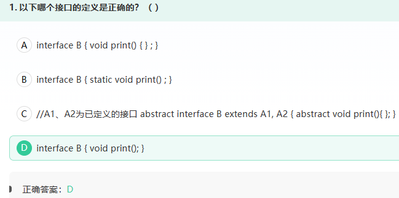
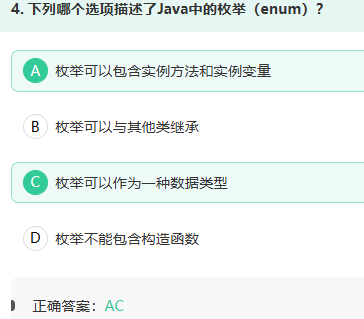
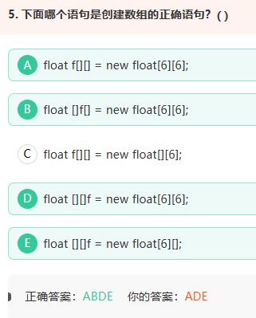
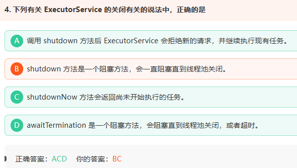
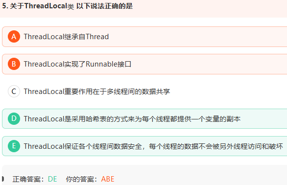
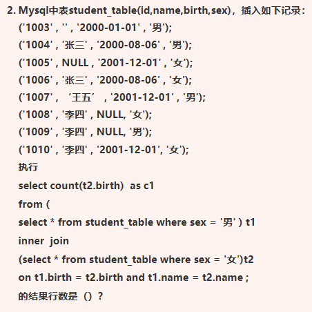

1.



A.应该没有大括号；B.接口中的方法可以被default和static修饰，但是被修饰的方法必须有方法体;C.接口可以多继承,错在抽象方法不能有方法体

2.



B.枚举隐式继承自java.lang.Enum类，且Java不支持多继承，因此枚举不能被其他类继承，也不能继承其他类；D.枚举可以包含构造函数，但必须为私有（默认隐式私有）

java不支持多继承：一个 Java 类不能同时继承两个或多个父类。

3.




数组命名时名称与[]可以随意排列，但声明的二维数组中第一个中括号中必须要有值，它代表的是在该二维数组中有多少个一维数组

4.



B.它只是发出“有序关闭”的通知，然后通常很快返回。线程池里的已有任务可能仍在后台运行

5.




A.它们是两个不同的类：`Thread`：表示线程；`ThreadLocal`：保存线程自己的局部数据。

B.ThreadLocal并没有实现Runnable接口，它与线程的执行方式无关，只负责提供线程本地变量的存储机制

C.Synchronized用于线程间的数据共享，而ThreadLocal则用于线程间的数据隔离。 

D.每个 `Thread` 对象内部都有自己的 `ThreadLocalMap`，它类似一个专门的哈希表：

```
Thread
  └── ThreadLocalMap
        ├── ThreadLocal对象1 → 当前线程的数据1
        └── ThreadLocal对象2 → 当前线程的数据2
```

不同线程拥有不同的 `ThreadLocalMap`，所以能够保存各自独立的数据。

不过“变量副本”是一种便于理解的说法，`ThreadLocal` 并不一定真的把原对象复制一份，而是每个线程分别保存一个值。

6.



答案：1

两点需要注意：1.NULL = NULL结果不是 `TRUE`，因此不能匹配。

2.COUNT(t2.birth)只统计非 `NULL` 值

所以查询返回 1 行，c1 的值也是 1


