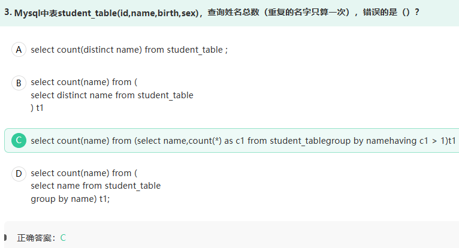
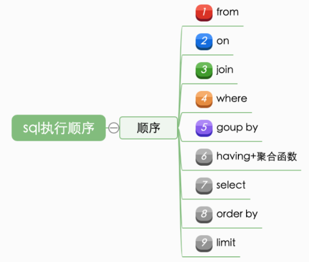
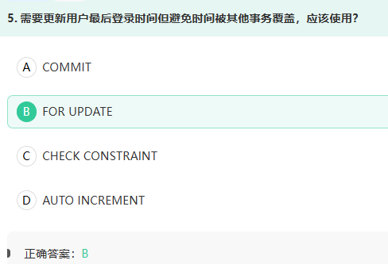
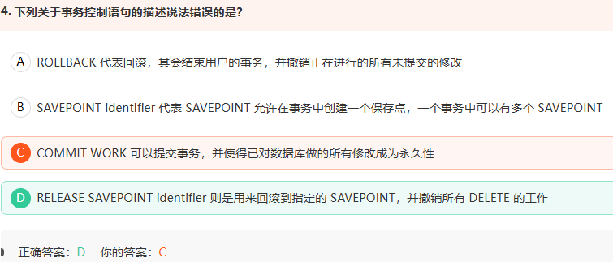
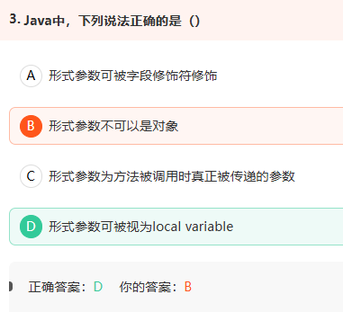
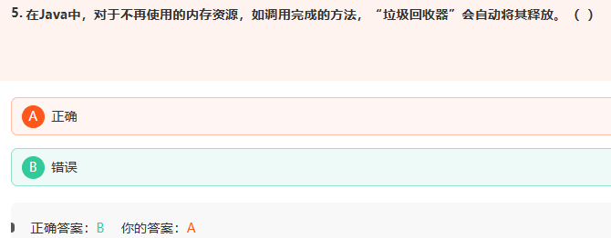
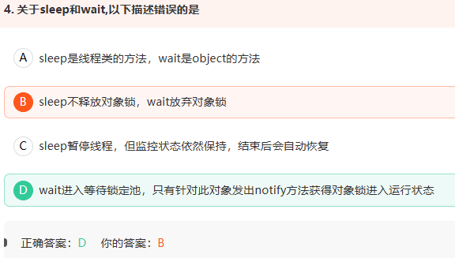
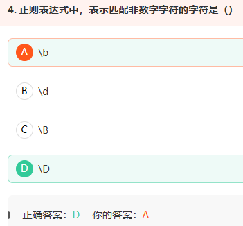

1.



c1 =1 就正确

2.纯知识点：



3.



FOR UPDATE是SQL的锁定机制，在事务中锁定选中行直到提交，能有效避免覆盖

4.



RELEASE SAVEPOINT identifier 的主要作用是删除一个保存点，但它不会自动撤销该保存点之后执行的操作。如果想撤销操作，需要使用 ROLLBACK TO SAVEPOINT identifier。 

5.



A.形式参数（形参）只能使用final修饰符（用于限制参数在方法内被修改）

B.

- 形式参数可以是对象类型（如String、自定义类等），Java 支持通过引用传递对象。

- 示例：

  ```
  public void printMessage(String message) { ... } // 合法
  ```

C.

Java 采用 **值传递**，实际传递的是实参的副本（基本类型传递值，引用类型传递引用地址的副本），而非形参本身

D.

- 形式参数在方法内部的作用域与局部变量相同，仅在方法体内有效，且需在方法调用时初始化。

- 示例：

  ```
  public void greet(String name) { // name 是形参，作用域限于方法内
      System.out.println(name);
  }
  ```

6.



方法调用时，会创建栈帧在栈中，调用完是程序自动出栈释放，而不是gc释放

 JVM 内存可简单分为三个区： 

  1、**堆区（heap）**：用于存放所有对象，是线程共享的（注：数组也属于对象） 

  2、**栈区（stack）**：用于存放基本数据类型的数据和对象的引用，是线程私有的（分为：虚拟机栈和本地方法栈） 

  3、**方法区（method）**：用于存放类信息、常量、静态变量、编译后的字节码等，是线程共享的（也被称为非堆，即 None-Heap） 

  **Java 的垃圾回收器（GC）主要针对堆区**

7.



D.线程调用 `wait()` 后进入等待集合。其他线程调用：`lock.notify();`

只会唤醒一个等待线程，但被唤醒的线程：

1. 不会立即运行；
2. 不会立即获得对象锁；
3. 要等调用 `notify()` 的线程退出同步代码块、释放锁；
4. 然后再竞争锁，获得锁后才能继续执行。

而且线程还可能因为以下原因结束等待：

- `notifyAll()`
- `wait(timeout)` 超时
- 被中断
- 极少数情况下虚假唤醒

所以 D 中"只有 `notify`，并且直接获得锁进入运行状态”的描述错误。

C. 基本正确

`sleep()` 会让当前线程暂停指定时间，但不会释放锁。

休眠时间结束后，线程进入**可运行状态**，等待 CPU 调度，并不是保证立即开始执行。

所以“自动恢复”更严谨地说是：休眠结束后自动具备继续运行的资格。

A.因为任何对象都可以作为锁，所以 `wait()`、`notify()`、`notifyAll()` 定义在 `Object` 中

8.

